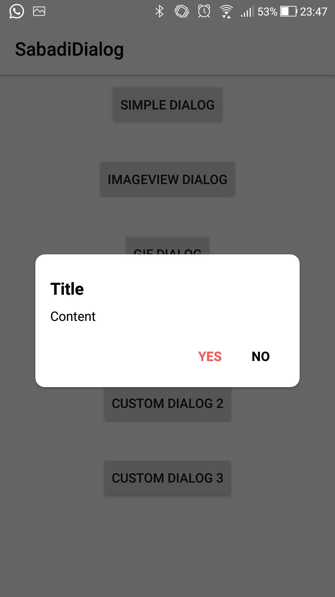
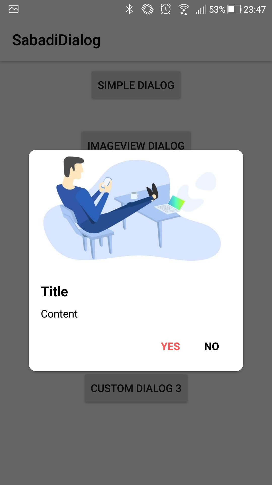
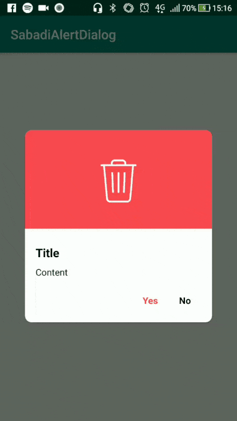
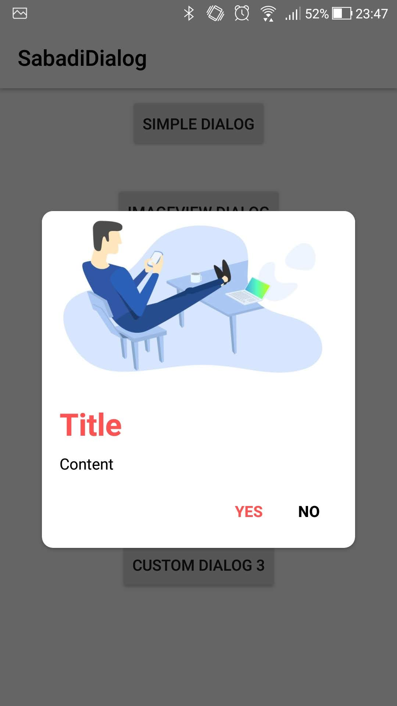
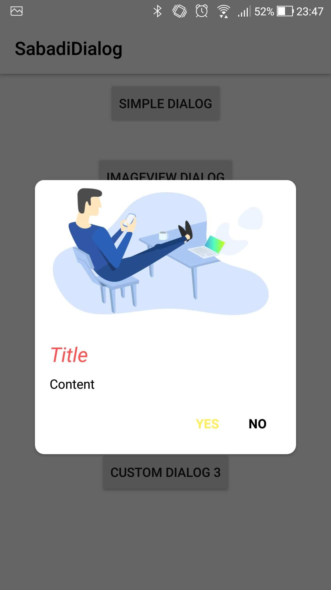
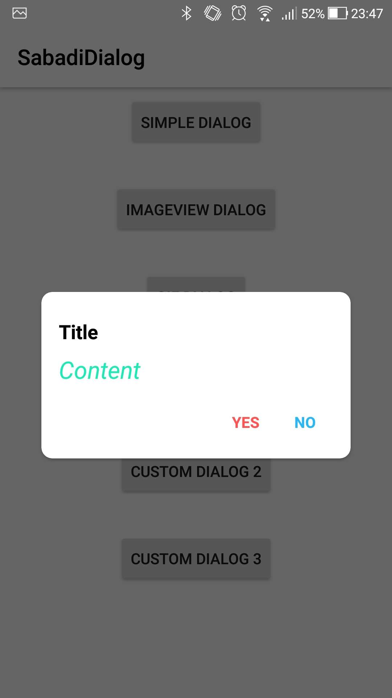

# AndroidDialog

O AndroidDialog veio com a finalidade de facilitar a utilização e customização do AlertDialog do Android.
Com ele é fácil criar um alert customizando título e subtítulo com cor, tamanho da fonte, typeface e estilo.
Além disso, é possível adicionar imagens(url e drawable) e gifs(url e drawable), e customizar as dimensões da imagem.

* Todo o código foi feito em `Kotlin`.
* Suporte a `GIF` utilizando a biblioteca [Glide](https://github.com/bumptech/glide).


## Adicionando ao projeto:

 Adicione o jitpack no arquivo `build.gradle(Project: seuProjeto)`

```kotlin
repositories {
   maven { url 'https://jitpack.io' }
}
```
Adicione a dependência no arquivo  `build.gradle(Module: app)`
```kotlin
dependencies {
  implementation 'com.github.jhonatansabadi:android-dialog:1.0.0'
}
```

## Definições

**title:** `String` - Texto que será exibido como título.
**titleColor:** `Int` - Cor do título.
**titleFontSize:** `Int` - Tamanho da fonte do título.
**content:** `String` - Texto que será exibido no subtítulo.
**contentColor:** `Int` - Cor do subtítulo.
**contentFontSize:** `Int` - Tamanho da fonte do subtítulo.
**yesButtonTextColor:** `Int` - Cor do texto do botão de confirmação.
**noButtonTextColor:** `Int` - Cor do texto do botão de rejeição/cancelamento.

### Estilos
Define estilo para título.
```kotlin
fun setTitleStyle(title: String, italic: Boolean, size: Int, color: Int)
```
Define estilo para o subtítulo.
```kotlin
fun setContentStyle(title: String, italic: Boolean, size: Int, color: Int)
```

### Imagens:
Define imagem através de um arquivo Drawable.
```kotlin
fun setImage(image: Drawable, height: Int, width: Int)
```
Define imagem através de um ID.
```kotlin
fun setImage(image: Int, height: Int, width: Int)
```
Define imagem através de uma string URL.
```kotlin
fun setImage(image: String, height: Int, width: Int)
```

### Ações:
Define  o que será feito ao clicar no botão **YES.**
```kotlin
fun yesButton {
	//action
}
```
Define  o que será feito ao clicar no botão **NO.**
```kotlin
fun noButton {
	//action
}
```

## Como utilizar

#### Simples AlertDialog
```kotlin
AndroidDialog(this).apply {
  title = "Title"
  content = "Content"
  yesButton { toast("YES") }
  noButton { toast("NO") }
}
```


#### Simples AlertDialog com ImageVIew
```kotlin
AndroidDialog(this).apply {
  title = "Title"
  content = "Content"
  setImage(R.drawable.dialog_image)
  yesButton { toast("YES") }
  noButton { toast("NO") }
}
```


#### Simples AlertDialog com GIF
```kotlin
AndroidDialog(this).apply {
  title = "Title"
  content = "Content"
  setImage(R.drawable.delete)
  yesButton { toast("YES") }
  noButton { toast("NO") }
}
```


#### Simples AlertDialog Custom1
```kotlin
AndroidDialog(this).apply {
  setTitleStyle(
	  title = "Title",
	  italic = true,
	  color = R.color.red,
	  size = 22
  )
  content = "Content"
  setImage(R.drawable.dialog_image)
  yesButton { toast("YES") }
  yesButtonTextColor = R.color.yellow
  noButton { toast("NO") }
}
```


#### Simples AlertDialog Custom2
```kotlin
AndroidDialog(this).apply {
  title = "Title"
  content = "Content"
  setImage(R.drawable.delete)
  yesButton { toast("YES") }
  noButton { toast("NO") }
}
```


#### Simples AlertDialog Custom3
```kotlin
AndroidDialog(this).apply {
  title = "Title"
  setContentStyle(
	  content = "Content",
	  italic = true,
	  color = R.color.green,
	  size = 22
  )
  yesButton { toast("YES") }
  noButton { toast("NO") }
  noButtonTextColor = R.color.blue
}
```



